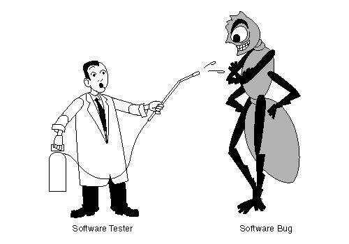
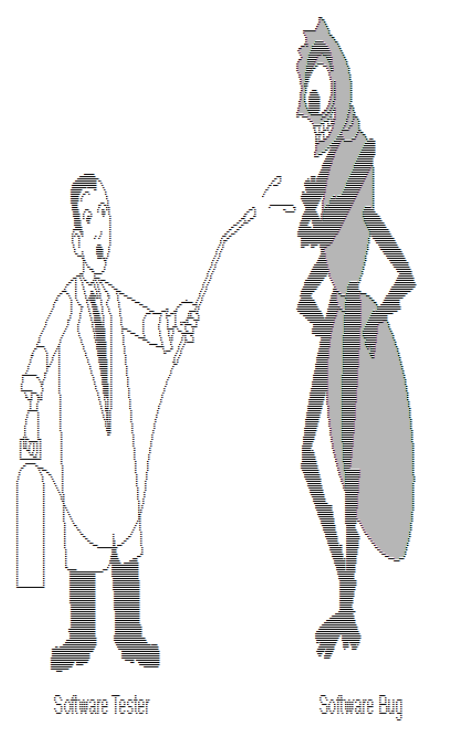

# Image to ASCII convertor

Made as a semestral project for "Object oriented programming" class at [FIT CTU](https://fit.cvut.cz/cs). 

Command line application, which loads image using JDK's ImageIO, converts them to ASCII, applies optional filters and exports them to file or to console.

The application is rigorously tested with unit tests and end-to-end tests. Testing strategy and analysis (part of "Quality assurance" class) can be found in czech language [here](docs/test_analysis.pdf).

## Usage

```
$ run -—help
----------------------------------------
Pick exactly ONE image source
----------------------------------------
--image-random => generates a random image as input
--image <path> => loads image given a <path> argument, accepts only jpg, png and gif images!
----------------------------------------
Pick exactly ONE conversion table
----------------------------------------
--table <tableName> => DEFAULT, uses given table for asciiConversion, accepts bourke, bourke-small and non-linear!
--custom-table <characters> => please provide at least one and at most 255 characters
----------------------------------------
Choose as many as you want, order matters
----------------------------------------
--flip <axis> => flips image on either X or Y axis, accepts x/X, y/Y
--scale <scale> => scales image, accepts 0.25, 1 or 4
--rotate <degrees> => rotates image, accepts any multiple of 90
--output-file <file> => saves ASCII image into given file
--output-console => print ASCII image into console
```

## Example output



```
run --image bug_before.gif --output-file bug_after.txt
```



